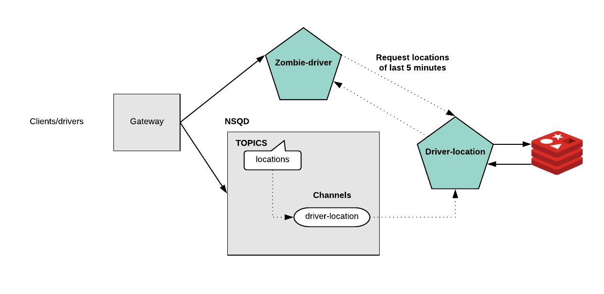

[](https://goreportcard.com/report/github.com/spirosoik/go-driver-microservices)

## Overview



- `gateway` just forwards or transforms the requests. Exposes the endpoints and decides the transport method based on `./gateway/config.yml`
- `driver location service` receives all the location data by the driver through NSQ.
- `zombie driver service` checks if the driver has been moved from his location and it's a zombie driver or not through HTTP.

### Prerequisites

Your machine should have installed the following tools in order to run the project:
- `Go` and you can find the instructions [here](https://golang.org/doc/install).
- `Docker` client and you can find instructions [here](https://docs.docker.com/install/)
- `docker-compose` cli tool. You can find instructions [here](https://docs.docker.com/compose/install/)

### Usage

All the setup is based on Docker containers. Each service has its own Dockerfile and it builds each go microservice explicitly. Each `Dockerfile` is declared on the root path of each service. More specifically here
- [Gateway](./gateway/Dockerfile) 
- [Driver Location](./driver-location/Dockerfile) 
- [Zombie Driver](./zombie-driver/Dockerfile) 

So there is no need by your side to set the project in a `$GOPATH` you can use it immediately.

The ports which are available for usage of each microservice are exposed and are declared in [docker-compose.yml](./docker-compose.yml). In this case the only exposed port is for *gateway* service which is the *8080*.

The commands which you should use in order to run all the services are the followings:

```
make
docker-compose up -d
```


